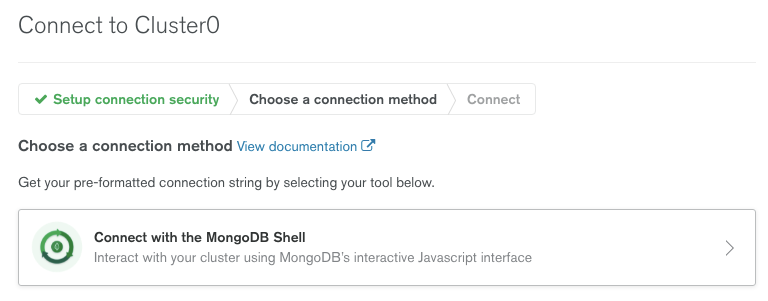

# Realm Mobile Challenge - Backend Realm App

## Building and running the app

1. If you don't already have one, [create a MongoDB Atlas Cluster](https://cloud.mongodb.com/), keeping the default name of `Cluster0`.
1. Install the [Realm CLI](https://docs.mongodb.com/realm/deploy/realm-cli-reference) and [create an API key pair](https://docs.atlas.mongodb.com/configure-api-access#programmatic-api-keys).
1. Download the repo and install the Realm app:
```
git clone git@github.com:mongodb-developer/realm-mobile-challenge.git
cd realm-mobile-challenge/Realm-Backend/MyRChat
realm-cli login --api-key <your new public key> --private-api-key <your new private key>
realm-cli import -y
```
4. From the Atlas UI, click on the Realm logo and you will see the RChat app. Open it and copy the App Id (you'll need it for the mobile app)


## Optional – Add database views to make is easier to analyse room data

As part of the challenge, you'll need to analyze the automated room entry/exit logs. These views will make that much simpler.

1. [Install the `mongosh` command-line tool](https://docs.mongodb.com/mongodb-shell/install/)
1. From the Atlas UI, add your current IP address to the Network Access list:

1. From the Atlas UI, add a new database user (using username/password):

1. From the Atlas UI, select "Command Line Tools" then "Connect Instructions", "Connect with the MongoDB Shell:



1. Copy the command:

1. Paste the command to your terminal and run
1. From the `mongosh` command-line, run these commands:
```
use RChat
db.createView('viewMessagesByRoom', 'ChatMessage', [{$match: {
  author: "room"
}}, {$project: {
  _id:0,
  timestamp: 1,
  messageComponents: {
    $split: ["$text", " - "]
  }
}}, {$project: {
  timestamp: 1,
  room: {$arrayElemAt: ["$messageComponents", 0]},
  action: {$arrayElemAt: ["$messageComponents", 1]},
  suspect: {$arrayElemAt: ["$messageComponents", 2]}
}}, {$sort: {
  timestamp: 1
}}, {$group: {
  _id: "$room",
  activity: {
    $push: {suspect: "$suspect", action: "$action", timestamp: "$timestamp"}
  }
}}, {$project: {
  _id: 0,
  room: "$_id",
  activity: 1
}}])

db.createView('viewRoomsBySuspect', 'ChatMessage', [
    {
      $match: {
        author: "room"
      }
    },
    {
      $project: {
        _id: 0,
        timestamp: 1,
        messageComponents: {
          $split: [
            "$text",
            " - "
          ]
        }
      }
    },
    {
      $project: {
        timestamp: 1,
        room: {$arrayElemAt: ["$messageComponents",0]},
        action: {$arrayElemAt: ["$messageComponents", 1]},
        suspect: {$arrayElemAt: ["$messageComponents", 2]
        }
      }
    },
    {
      $sort: {
        "timestamp": 1
        }
    },
    {
      $group: {
        _id: "$suspect",
        "activity": {
          $push: {room: "$room", action: "$action", timestamp: "$timestamp"}
        }
      }
    },
    {
      $project: {
        _id: 0,
        suspect: "$_id",
        activity: 1
      }
    }
  ]
)

db.createView('viewMessagesBySuspect', 'ChatMessage', [
{$match: {
  author: {$ne: "room"}
}}, {$sort: {
  timestamp: 1
}}, {$project: {
  _id: 0,
  author: 1,
  text: 1,
  timestamp: 1
}}, {$group: {
  _id: "$author",
  count: {$sum: 1},
  messages: {
    $push: {
      text: "$text",
      timestamp: "$timestamp"
    }
  }
}}, {$project: {
  _id: 0,
  author: "$_id",
  count: 1,
  messages: 1
}}])
```
